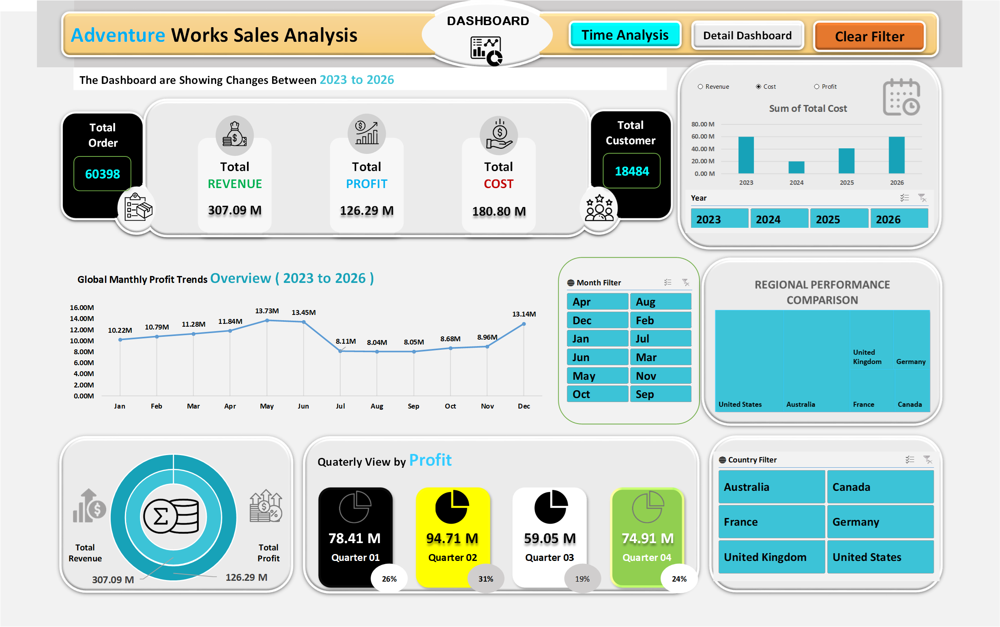
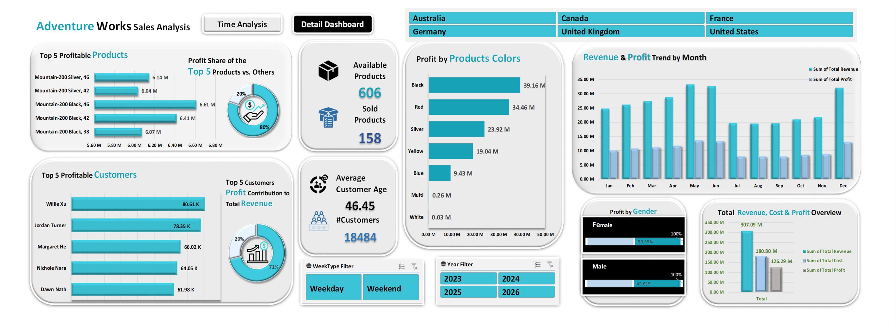

# Adventure Works Sales Analysis (Excel)

*An interactive two-page sales and profitability dashboard built in Microsoft Excel with Power Query, Power Pivot and DAX. No Power BI was used.*

## Overview

This project turns the Adventure Works sales data (products, customers, sales and dates tables) into one interactive Excel dashboard. Built in July 2026.

The dashboard is designed to answer questions such as:

- Who are the most profitable customers?
- Which products drive the most profit?
- How is revenue trending month over month?

**Data:** Adventure Works sample data (a fictional company), [add source link]. This is not real company data.

## Key Metrics

Numbers shown on the dashboard:

| Metric | Value |
|---|---|
| Records in the dataset | 60398 |
| Date range | 2021 – 2026 |
| Total Revenue | 307.09 |
| Total Cost | 180.80 |
| Total Profit | 126.29 |

## Data Cleaning & Preparation

The data was prepared in Power Query. A separate cleaned dataset file is not included because the dataset is too large to clean without Power Query.

The workbook loads 6 separate tables (1 fact table and 5 dimension tables). Main steps applied to each:

| Query | Rows loaded | Main steps |
|---|---|---|
| FactInternetSales | 60,398 | Promoted headers, changed data types, kept only the required columns, renamed columns, added 3 custom columns |
| DimCustomer | 18,484 | Promoted headers, changed data types, merged columns, kept only the required columns, replaced values (including in the Gender column) |
| DimProduct | 606 | Promoted headers, changed data types, kept only the required columns, replaced values in the Color column |
| DimGeography | 655 | Promoted headers, changed data types, kept only the required columns, renamed columns |
| DimSalesTerritory | 10 | Promoted headers, changed data types, removed columns, filtered rows |
| DimDate | 2,191 | Promoted headers, changed data types, kept only the required columns, renamed columns, inserted Year, Month, Month Name, Day Name and Quarter, added a conditional column, added a prefix, replaced values, filtered rows |

**Transformation details**

- **DimCustomer:** Combined FirstName and LastName into a Full Name column; replaced "M" with "Male" and "F" with "Female" in Gender; kept only the required columns.
- **DimProduct:** Kept ProductKey, EnglishProductName and Color; replaced "NA" with "Red" in the Color column.
- **DimGeography:** Kept GeographyKey, City, country and SalesTerritoryKey; renamed EnglishCountryRegionName to Country.
- **FactInternetSales:** Added Total Revenue (OrderQuantity × UnitPrice), Total Cost (OrderQuantity × Cost) and Total Profit (Total Revenue − Total Cost); renamed ProductStandardCost to Cost.
- **DimSalesTerritory:** Removed the SalesTerritoryImage column and excluded rows where SalesTerritoryRegion is "NA".
- **DimDate:** Added Year, Month, Month Name, Day Name, WeekType and Quarter columns; the Year values were remapped to a 2021–2026 range.
- 
## How It Works

1. **Power Query:** imported, cleaned and combined the raw tables (products, customers, sales, dates). [confirm which tables were merged and which stayed separate]
2. **Power Pivot (Data Model):** relationships between the tables using a star-schema design. [list the tables in the model]
3. **DAX measures:** custom measures for Revenue, Profit, Cost and Profit Share %.
4. **PivotTables and PivotCharts:** bar, column, donut and trend charts.
5. **Slicers:** filters for Year, Month, Country, Gender and Weekday/Weekend.
6. **Layout:** custom shapes, icons and number formatting.

## Key Insights

- Total revenue is 307.09 M, total cost is 180.80 M and total profit is 126.29 M across 60,398 orders and 18,484 customers.
- Black is the most profitable product color (39.16 M), followed by Red (34.46 M) and Silver (23.92 M).
- The top 5 profitable customers are led by Willie Xu (80.61 K), followed by Jordan Turner (78.35 K).

## Tools

- Microsoft Excel: Power Query, Power Pivot (Data Model), DAX, PivotTables, PivotCharts, Slicers

## Files

| File | Description |
|---|---|
| `[Adventure_Works_Sales_Raw_Data_20260702_V01.xlsx]` | Raw Adventure Works data (before cleaning) |
| `Adventure_Works_Sales_Dashboard_20260705_V01.xlsx` | Excel workbook with the two-page interactive dashboard |
| `[Adventure_Works_Sales_Dashboard_Page1_20260705_V01.png]` | Dashboard screenshot, page 1 |
| `[Adventure_Works_Sales_Dashboard_Page2_20260705_V01.png]` | Dashboard screenshot, page 2 |

## Author

**Shanto Islam** – Data Analyst

- GitHub: [shanto-islam-analytics](https://github.com/shanto-islam-analytics)
- LinkedIn: https://www.linkedin.com/in/shanto85206
