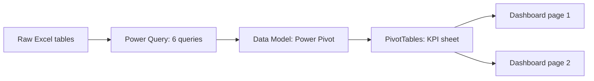
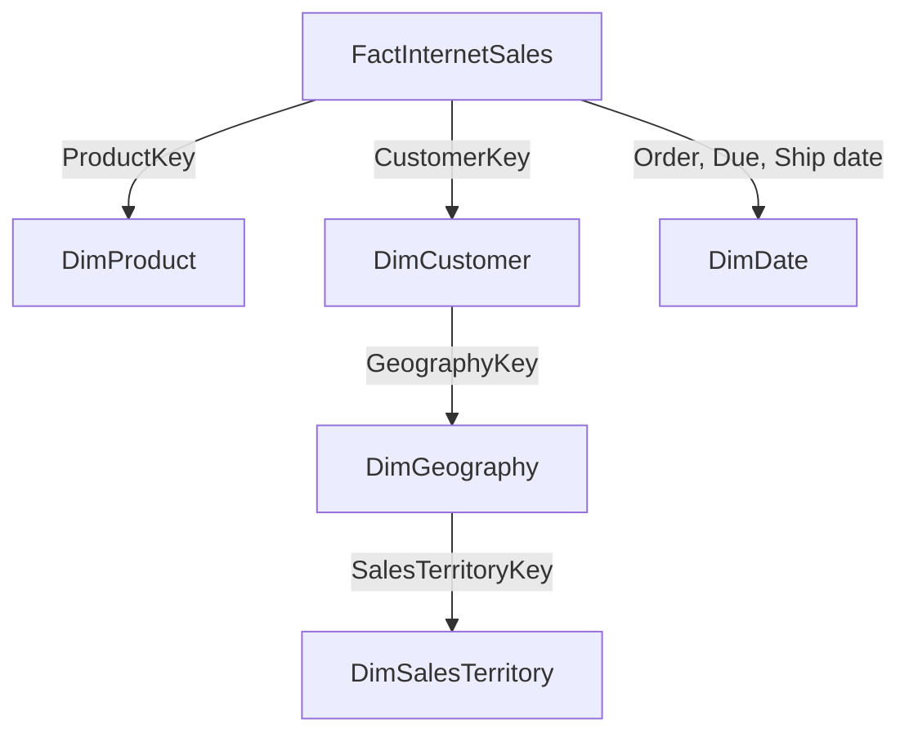

<div align="center">

# Adventure Works Sales & Profitability Analysis (Excel)

**Which markets, products and months drive revenue and profit, and where is the growth being left on the table?**


*An interactive two-page sales and profitability dashboard built entirely in Microsoft Excel. No Power BI was used.*

</div>

---

## Dashboard Preview

**Page 1: Executive KPI Dashboard**


**Page 2: Detail Dashboard (products, customers and trends)**


---

## Table of Contents

1. [Business Problem](#business-problem)
2. [Executive Summary](#executive-summary)
3. [Data](#data)
4. [Data Cleaning & Preparation](#data-cleaning--preparation)
5. [Methodology](#methodology)
6. [Key Findings](#key-findings)
7. [Recommendations](#recommendations)
8. [Limitations & Next Steps](#limitations--next-steps)
9. [Repository Structure](#repository-structure)
10. [About the Author](#about-the-author)

---

## Business Problem

Adventure Works is a fictional bicycle and accessories company. Management wants one place to see how the online business is performing and to answer:

- Which **countries** bring in the most revenue?
- How do **revenue, cost and profit** change by year, quarter and month?
- Which **products** and **customers** are the most profitable?
- Which **product colours** earn the most profit?
- How much of the product catalogue actually **sells**?

This project turns six raw tables into one interactive Excel dashboard that answers these questions with a few clicks.

---

## Executive Summary

| Metric | Value |
|---|---|
| **Total Revenue** | $307.09 M |
| **Total Cost** | $180.80 M |
| **Total Profit** | $126.29 M |
| **Profit Margin** | 41.1% |
| **Total Orders** | 60,398 |
| **Total Customers** | 18,484 |
| **Average Customer Age** | 46.45 |
| **Products Available / Sold** | 606 / 158 |

**In one line:** two markets (United States and Australia) deliver 63% of revenue, profit margin holds steady near 41%, and only about a quarter of the product catalogue recorded a sale.

---

## Data

| Item | Detail |
|---|---|
| Dataset | Adventure Works sample data (fictional company, not real sales) |
| Source | [add source link] |
| Sales period | 2023 – 2026 (sample dates, see note below) |
| Fact table | `FactInternetSales`, 60,398 rows |
| Dimension tables | `DimCustomer` (18,484), `DimDate` (2,191), `DimGeography` (655), `DimProduct` (606), `DimSalesTerritory` (10) |
| Currency | USD (Adventure Works default) |
| Countries | Australia, Canada, France, Germany, United Kingdom, United States |

> **Note:** the original sample dates were re-labelled to the 2023–2026 range in Power Query to build a modern-looking time analysis. Trends are illustrative, not real trading history.

---

## Data Cleaning & Preparation

All preparation was done in **Power Query**, one query per table (6 queries in total: 1 fact table and 5 dimension tables).

| Table | Steps applied |
|---|---|
| **FactInternetSales** | Promoted headers, set data types, kept only the needed columns, renamed `ProductStandardCost` to `Cost`, added **Total Revenue** (`OrderQuantity × UnitPrice`), **Total Cost** (`OrderQuantity × Cost`) and **Total Profit** (`Total Revenue − Total Cost`) |
| **DimCustomer** | Promoted headers, set data types, merged `FirstName` and `LastName` into **Full Name**, kept only the needed columns, replaced `M`/`F` with **Male**/**Female** |
| **DimDate** | Promoted headers, set data types, kept the date column, added **Year**, **Month**, **Month Name**, **Day Name**, **WeekType** and **Quarter** (`Qua1` to `Qua4`), re-labelled years to the 2021–2026 range |
| **DimGeography** | Promoted headers, set data types, kept `GeographyKey`, `City`, country and `SalesTerritoryKey`, renamed `EnglishCountryRegionName` to **Country** |
| **DimProduct** | Promoted headers, set data types, kept `ProductKey`, product name and colour, replaced colour `NA` with `Red` |
| **DimSalesTerritory** | Promoted headers, set data types, removed the image column, filtered out the `NA` territory |

The cleaned tables are loaded into the **Excel Data Model**. A separate cleaned file is not included because the data is too large to clean by hand without Power Query.

---

## Methodology



**Table structure** (keys kept in Power Query):



**Workbook sheets:** `KPI` (all PivotTables) · `Dashboard` (page 1) · `Time Analysis` (page 2)

**Interactivity**
- Slicers: Year, Month, Country, Week Type (Weekday / Weekend)
- An option button that switches the yearly chart between Revenue, Cost and Profit
- Navigation buttons between pages and a **Clear Filter** button
- Charts: KPI cards, line, column, bar, donut and treemap

---

## Key Findings

### 1. Profit margin is steady at about 41%
The business earns **$126.29 M profit on $307.09 M revenue (41.1%)**. The margin stays between 40.2% and 41.6% in every year, so profit moves with sales volume, not with pricing changes.

| Year | Revenue | Cost | Profit | Margin |
|---|---|---|---|---|
| 2023 | $101.86 M | $59.70 M | $42.16 M | 41.4% |
| 2024 | $33.37 M | $19.97 M | $13.40 M | 40.2% |
| 2025 | $69.48 M | $41.31 M | $28.18 M | 40.6% |
| 2026 | $102.38 M | $59.83 M | $42.55 M | 41.6% |

### 2. Two countries generate 63% of revenue
The United States ($97.59 M, 31.8%) and Australia ($95.22 M, 31.0%) lead by a wide margin. The United Kingdom follows with 11.7%, then Germany (9.9%), France (8.8%) and Canada (6.8%).

### 3. Profit peaks in May–June and falls in the second half
Monthly profit reaches **$13.73 M in May** and $13.45 M in June, drops to about **$8 M from July to September** (low of $8.04 M in August), then recovers to $13.14 M in December. The first half of the year earns **56.5%** of profit.

### 4. Quarter 3 is the weakest quarter
Revenue by quarter: Q1 $78.41 M (26%), **Q2 $94.71 M (31%)**, **Q3 $59.05 M (19%)** and Q4 $74.91 M (24%). Q3 is about **38% below Q2**.

### 5. Black is the most profitable colour
Profit by product colour: **Black $39.16 M (31.0%)**, Red $34.46 M (27.3%), Silver $23.92 M (18.9%), Yellow $19.04 M (15.1%) and Blue $9.43 M (7.5%). Multi and White products add under 0.3%. *Red includes products whose source colour was `NA`, see Limitations.*

### 6. Only 26% of products sold
Of **606 available products, just 158 recorded a sale**, so 448 products (74%) had no internet sales in this dataset.

### 7. Customers are balanced by gender
Profit is split almost evenly: **50.4% female and 49.6% male**. The average customer age is **46.45**.

---

## Recommendations

1. **Protect the US and Australian markets first.** They carry 63% of revenue, so any loss there hurts most. Canada (6.8%) is the smallest market and the clearest room to grow.
2. **Plan stock and campaigns around the May–June peak and December.** Add promotions in July to September, when profit falls to about $8 M a month and Q3 sits 38% below Q2.
3. **Review the 448 products with no sales.** Retire weak lines, bundle them with best-sellers, or relaunch them with targeted offers.
4. **Prioritise Black (and top-selling colour) stock** since Black alone brings 31% of profit.
5. **Keep pricing and cost discipline.** A stable 41% margin is a strength, so grow through volume and new customers rather than discounts.
6. **Keep campaigns gender-neutral and aimed at mid-40s buyers**, matching the 50/50 profit split and the 46-year average age.

---

## Limitations & Next Steps

- This is **sample data for a fictional company**, and its dates were re-labelled, so year-over-year trends are illustrative. Year totals are also uneven (2024 is about a third of 2023 and 2026).
- **Revenue = order quantity × unit price.** Discounts, tax and freight are not included, and cost uses the product standard cost.
- Only the **internet sales** table is loaded. Products with no sales here may sell through other channels not in this dataset.
- Products with colour `NA` in the source were assigned to **Red** in Power Query, so Red's share is overstated.
- **Week Type** treats Sunday as the weekend and every other day as a weekday.

**Next steps:** add reseller sales, calculate year-over-year growth, analyse discounts, segment customers with RFM, and rebuild the dashboard in Power BI for comparison.

---

## Repository Structure

```
Adventure-Works-Sales-Analysis/
├── README.md
├── Adventure_Works_Sales_Dashboard_20260705_V01.xlsx    # Data Model + PivotTables + dashboards
├── Adventure_Works_Sales_Raw_Data_20260702_V01.xlsx     # Original, unchanged
├── Adventure_Works_Sales_Dashboard_Page1_20260705_V01.png
└── Adventure_Works_Sales_Dashboard_Page2_20260705_V01.png
```

**How to use:** download the `.xlsx`, open it in desktop Excel (slicers and Power Pivot need the desktop app), and click the slicers to filter. Use **Clear Filter** to reset. If you refresh the Power Query data, update the source file path first.

---

## About the Author

**Shanto Islam**, Data Analyst
Excel · Power Query · Power Pivot · PivotTables · Dashboard Design

[GitHub](https://github.com/shanto-islam-analytics) · [LinkedIn](https://www.linkedin.com/in/shanto85206/?lipi=urn%3Ali%3Apage%3Ad_flagship3_profile_view_base_contact_details%3B9wZJtzzDQAaQRptxo4sqgA%3D%3D)

If you found this project useful, please give it a ⭐
